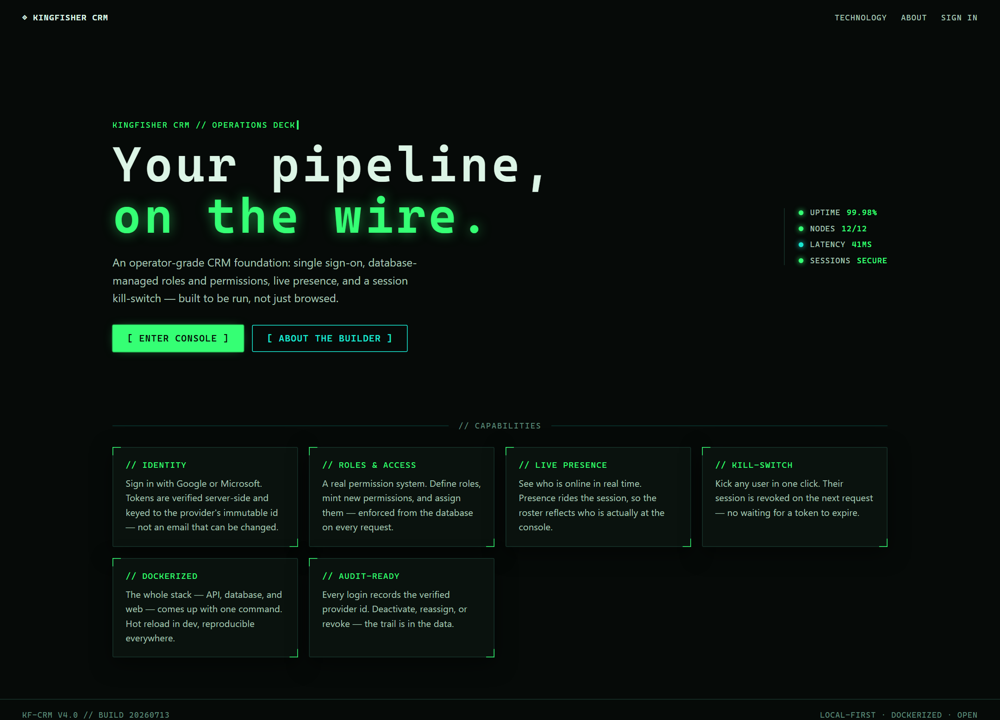

# Kingfisher CRM

**An operator-grade internal console** — single sign-on that verifies the provider's *immutable*
identity, a real database-backed **roles + permissions** system, a **live presence** roster with a
**session kill-switch**, deep user management, an admin request-audit log, and a Matrix/terminal
("DATASTREAM") interface. FastAPI + React + MySQL, run locally with Docker Compose.


&nbsp;·&nbsp; FastAPI · React 18 + TypeScript · MySQL 8 · Docker · Alembic · WebSockets

> **Scope:** built to be *run*, not just browsed. AWS deployment is intentionally **not** wired up —
> everything here runs locally on Docker. `deploy/` holds production reference files only.



---

## Contents

- [What it does](#what-it-does)
- [Screens](#screens)
- [Architecture](#architecture)
- [Security model](#security-model)
- [Quick start](#quick-start)
- [Signing in](#signing-in)
- [API surface](#api-surface)
- [Testing & CI](#testing--ci)
- [Project layout](#project-layout)
- [Common commands](#common-commands)

---

## What it does

### Authentication keyed to the provider's immutable ID
Sign in with **Google** or **Microsoft**. Tokens are verified **server-side** and each account is
keyed to the provider's **immutable subject id** (Google `sub` / Microsoft `oid`) — *never* the
email address. A user who changes their provider email can't hijack or merge into another account.
The verified id is stored and surfaced in the admin UI. A gated **dev-login** (local only, off by
default) lets you click into the app before OAuth keys exist.

### Roles & permissions (RBAC) you can edit at runtime
Every user has exactly one role; roles hold permissions; **admins create new permissions and roles**
and assign them through a grouped permission-matrix builder. Access is read fresh from the database
on **every request**. Built-in permissions: `users.read`, `users.manage`, `roles.manage`,
`presence.view`, `presence.kick`, `settings.manage`, `logs.view`. System roles are protected and
privilege-amplification is blocked (you can only grant what you already hold).

### Deep, permission-gated user management
A paginated, filterable directory (search · role · status · online) showing role, department,
title, and last-active. **Inline edit** opens an in-row modal that reuses the full profile editor —
profile fields, role reassignment, activate/deactivate, approve, and kick — with **every control
shown only if you hold the matching permission**. Plus **bulk actions** and **CSV export** (with
spreadsheet-formula-injection neutralised).

### Real-time presence + a session kill-switch
Who's online updates live over a **WebSocket** (with an HTTP polling fallback). Any authorised admin
can **kick** a user — the session is revoked on that user's very next request via a per-user token
epoch. Deactivation and logout are durable revocations too, so old cookies can't be resurrected.

### Admin controls, GPS, and an audit log
Admins set the sign-up mode (**open / approval / closed**), toggle each provider, choose the default
role, and **approve pending sign-ups**. An **optional GPS capture** on login (native prompt; denial
is a no-op) records last-known coordinates — visible only to the user themselves and to
`users.manage` holders. A **request activity log** records every `/api` call (method · endpoint ·
user · IP · status) for holders of `logs.view`.

Seed realistic demo data (local): `docker compose exec api python -m app.scripts.seed_demo`.

---

## Screens

### Dashboard — real data only
KPIs, sign-ups over 14 days, account-status split, users-by-role, sign-in providers, live presence,
and a "your access" panel listing your role's actual permissions.


### User directory — expanded & permission-gated


### Inline edit — the full profile editor in a modal
Identity, profile fields, and admin controls (role / active / kick) — each gated by permission.


### Roles & Access — the permission-matrix builder


### Request activity log


### Site settings — sign-up mode, providers, approvals


### Profile & identity


### A user's detail page


### Sign in


### Technology & About
| Technology | About |
|---|---|
|  |  |

---

## Architecture

- **Backend** — Python 3.12, **FastAPI**, **SQLAlchemy 2.x**, **Alembic** migrations, PyMySQL.
  All routes live under `/api`. Errors share a `{"detail": {"code", "message"}}` envelope.
- **Frontend** — **React 18 + TypeScript + Vite**, React Router v6, hand-written CSS
  (the "DATASTREAM" terminal theme). Vite proxies `/api` (incl. WebSocket upgrade) to the API.
- **Database** — **MySQL 8.0** (`utf8mb4`), schema owned entirely by Alembic (migrations `0001`…`0006`).
- **Runtime** — **Docker Compose** (mysql + api + web with hot reload). CI runs on **Node 24**.

```
Browser ──HTTP/WS──▶  Vite dev server ──proxy /api──▶  FastAPI  ──▶  MySQL
                              │                           │
                        React SPA                  SQLAlchemy + Alembic
```

Identity flow: provider ID token → **verified server-side** → app issues its own short **HS256
session JWT** in an `HttpOnly`, `SameSite=Lax` cookie → role + permissions + active/approved state
re-read from the DB on every request.

---

## Security model

Hardened across several adversarial-review passes (each one caught and fixed real bugs). Highlights:

- **Identity = provider subject id, never email.** Two providers sharing an email are two accounts;
  a changed email never merges or hijacks.
- **No privilege amplification.** You can only grant a role/permission you already hold; system
  roles are admin-only to edit; the `admin` role is locked.
- **Last-admin protection.** The final active admin can't be demoted or deactivated.
- **Durable revocation.** Kick and deactivation stamp a per-user token epoch, so old session
  cookies are rejected on the next request (and reactivation can't resurrect them).
- **Location privacy.** Opt-in GPS is stripped from **every** API path — list, detail, *and the kick
  response* — for anyone who isn't the user themselves or a `users.manage` holder.
- **CSV-injection safe.** Exported cells beginning with `= + - @` are neutralised.
- **Login-CSRF guard** (JSON-only Content-Type on the cookie-setting login routes) + `SameSite=Lax`.
- Optional `ALLOWED_EMAIL_DOMAINS` / `ALLOWED_AZURE_TENANTS` lock provisioning to your org.

---

## Quick start

```bash
cp .env.example .env
python -c "import secrets; print(secrets.token_hex(32))"   # paste into SESSION_JWT_SECRET
# To click into the app before OAuth is set up, set DEV_AUTH_ENABLED=true in .env

docker compose up --build -d
docker compose exec api alembic upgrade head
docker compose exec api python -m app.scripts.seed_demo   # optional: demo users + roles

#   http://localhost:5173          → the app (landing page)
#   http://localhost:8000/api/docs → API docs
#   http://localhost:8000/api/health
```

Reset the DB: `docker compose down -v && docker compose up -d && docker compose exec api alembic upgrade head`.

---

## Signing in

- **Google / Microsoft** buttons appear on the login page only once their client IDs are set
  (`GOOGLE_CLIENT_ID` / `AZURE_CLIENT_ID`, plus the `VITE_*` build vars). Until then they're hidden.
- **Dev login** (local only): with `DEV_AUTH_ENABLED=true`, the login page shows a dev form
  (any email + role). `POST /api/auth/dev` is **only mounted when `APP_ENV=local` and
  `DEV_AUTH_ENABLED=true`**. The first email in `ADMIN_EMAILS` becomes an admin.

---

## API surface

| Method | Path | Permission | Purpose |
|---|---|---|---|
| GET | `/api/health` | — | liveness + DB check |
| GET | `/api/auth/config` | — | which sign-in methods are available |
| POST | `/api/auth/google` · `/microsoft` | — | verify ID token → session cookie |
| POST | `/api/auth/dev` | — (local only) | dev login |
| POST | `/api/auth/logout` | — | clear cookie (durable revoke) |
| GET | `/api/auth/me` | session | current user |
| POST | `/api/auth/location` | session | store optional last-known GPS |
| GET | `/api/dashboard` | session | headline stats (incl. online count) |
| GET | `/api/dashboard/analytics` | `users.read` | chart data (roles, providers, signups, status) |
| GET | `/api/users` | `users.read` | directory + filters (`search`, `role_id`, `status`, `online`, `limit`, `offset`) |
| GET | `/api/users/{id}` | self or `users.read` | user detail |
| PATCH | `/api/users/{id}/profile` | self or `users.manage` | edit profile fields |
| PATCH | `/api/users/{id}/role` | `users.manage` | reassign role |
| PATCH | `/api/users/{id}/status` | `users.manage` | activate / deactivate |
| POST | `/api/users/{id}/approve` | `users.manage` | approve a pending sign-up |
| POST | `/api/users/{id}/kick` | `presence.kick` | force sign-out |
| POST | `/api/users/bulk` | `users.manage` | bulk approve/activate/deactivate/assign-role |
| GET | `/api/users/export.csv` | `users.read` | CSV of the filtered directory |
| GET · PUT | `/api/admin/settings` | `settings.manage` | site settings (signup mode, providers, default role) |
| GET | `/api/roles` · `/api/permissions` | `roles.manage` | list |
| POST | `/api/roles` · `/api/permissions` | `roles.manage` | create |
| PATCH · DELETE | `/api/roles/{id}` | `roles.manage` | edit / delete (custom) |
| GET | `/api/presence/online` | `presence.view` | who's online |
| POST | `/api/presence/heartbeat` | session | presence ping (WebSocket polling fallback) |
| WS | `/api/ws/presence` | session | real-time presence stream |
| GET | `/api/admin/logs` | `logs.view` | request activity log (filters: `search`, `method`, `user_id`) |

---

## Testing & CI

- **Backend** — `pytest` runs the full HTTP stack against a dedicated `*_test` MySQL database, with
  schema built by the real Alembic migrations (never `create_all`). Coverage spans auth, RBAC guards,
  presence/kick, bulk actions, CSV-injection, location privacy, pagination, and the audit log.
- **CI** (`.github/workflows/ci.yml`, Node 24) — a single `test` job: `ruff check` + `ruff format
  --check`, an Alembic **single-head + upgrade** smoke test, `pytest`, then the frontend
  `tsc --noEmit` + `eslint` + `vite build`. No deploy job (AWS is deferred).

---

## Project layout

```
backend/   FastAPI app, SQLAlchemy models, Alembic migrations (0001 schema … 0006), pytest suite
frontend/  React + Vite SPA (DATASTREAM terminal theme)
deploy/    production compose + Caddyfile (reference; not used locally)
docs/img/  README screenshots
.github/   CI: lint, migrate, pytest, frontend build — no deploy job
```

---

## Common commands

```bash
docker compose exec api alembic upgrade head             # apply migrations
docker compose exec api python -m app.scripts.seed_demo  # seed demo data (local only)
docker compose exec api pytest                           # backend tests
docker compose exec api ruff check .                     # backend lint
docker compose exec web npm run lint                     # frontend typecheck + lint
docker compose logs -f api web                           # tail logs
```
