# Sharpbill — Access Control Console

**An access-control console for local development and evaluation** — single sign-on that verifies
the provider's *immutable* identity, a database-backed **roles + permissions** system, a **live
presence** roster with a **session kill-switch**, deep user management, request/security-event
telemetry, and a Matrix/terminal ("DATASTREAM") interface. React, ASP.NET Core, MySQL, and Docker
Compose form the supported local runtime.


&nbsp;·&nbsp; .NET 10 · ASP.NET Core · React 18 + TypeScript · MySQL 8.4 LTS · Docker · WebSockets

> **Supported boundary:** the repository and default Compose stack are for loopback-only local
> development and evaluation. They are not an approved production release or a compliance
> certification. AWS resources, managed database controls, deployment/rollback automation,
> external delivery from the repository outbox into a restricted SIEM/WORM audit sink, backup/PITR,
> production monitoring, distributed rate-limit/presence coordination, and production review
> ownership are intentionally outside this repository. `deploy/` contains unapproved reference
> files only.

> 🤖 **Built solo with a fleet of adversarial AI agents** — a real multi-agent SDLC that caught
> genuine privilege-escalation bugs in this very RBAC. The story, with the actual bugs, is in
> **[CASE_STUDY.md](CASE_STUDY.md)**.

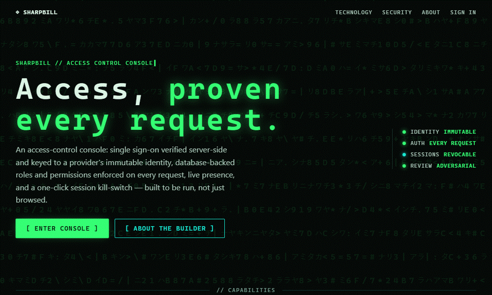

---

## Current baseline

- **Backend:** layered .NET 10 / ASP.NET Core service with contracts, domain, application
  abstractions, infrastructure adapters, workers, middleware, and DI composition.
- **Frontend:** React 18.3 + TypeScript 5.9 + Vite 8 with Vitest unit coverage and Playwright E2E
  coverage.
- **Data:** MySQL 8.4.10 LTS with an explicit `Sharpbill.Migrator` compatibility baseline at
  `0021`.
- **Local runtime:** loopback-only Docker Compose for `mysql`, one-shot `migrator`, `api`, and
  `web`.
- **Repository controls:** private GitHub repository, protected `main`, required CI checks,
  digest-pinned images/actions, SBOM generation, Trivy scans, Dependabot, and CODEOWNERS.
- **Production boundary:** AWS, backups/PITR, SIEM/WORM dispatch, production monitoring, and
  distributed rate-limit/presence coordination are production-owned.

See [`docs/TECH_STACK.md`](docs/TECH_STACK.md) for the canonical checked-in stack inventory,
including exact runtime/toolchain pins and the production boundary.

---

## Contents

- [Current baseline](#current-baseline)
- [What it does](#what-it-does)
- [Screens](#screens)
- [Architecture](#architecture)
- [Technology stack inventory](docs/TECH_STACK.md)
- [Security model](#security-model)
- [Data retention & privacy policy](docs/DATA_RETENTION_PRIVACY.md)
- [Legal documents & acceptance release process](docs/LEGAL_DOCUMENTS.md)
- [Quick start](#quick-start)
- [Signing in](#signing-in)
- [API surface](#api-surface)
- [Testing & CI](#testing--ci)
- [Project layout](#project-layout)
- [Common commands](#common-commands)

---

## What it does

### Authentication keyed to the provider's immutable ID
When configured and enabled, sign in with **Google** or **Microsoft**. Tokens are verified
**server-side** and each account is
keyed to the provider's **immutable subject id** (Google `sub` / Microsoft tenant-scoped
`(tid, oid)`) — *never* the email address. A user who changes their provider email can't hijack or
merge into another account, and equal Microsoft object IDs from different tenants remain distinct.
The verified id is stored; its external subject is returned only to that user or an administrator,
not to an ordinary directory viewer. A secret-gated **dev-login** endpoint (local environment only,
off by default) supports automated tests before OAuth keys exist.

### Roles & permissions (RBAC + per-user grants) you can edit at runtime
Every user has one role; roles hold permissions; **admins create new permissions and roles** and
assign them through a grouped permission-matrix builder. On top of the role, admins can **grant
individual permissions directly to a user** — so a user's **effective access = their role's
permissions ∪ their direct grants**. Access is read fresh from the database on **every request**. Built-in
permissions: `users.read`, `users.manage`, `users.export`, `roles.manage`, `presence.view`,
`presence.kick`, `settings.manage`, `logs.view`, `security_events.view`, `privacy.manage`.
Sensitive extraction is split from ordinary viewing: `users.read` does not grant CSV export, and
`logs.view` does not grant access to the durable security-event stream. Privacy holds and
account-lifecycle administration require the separate `privacy.manage` permission. Migrations
`0016` and `0019` grant these sensitive
permissions only to the built-in admin role; operators must delegate them deliberately. System
roles are protected, and role/direct-grant mutation paths require both `users.manage` and
`roles.manage` and enforce that a delegate can grant only permissions they already hold.

### Deep, permission-gated user management
A paginated, filterable directory (search · role · status · online) showing role, department,
title, and last-active. **Inline edit** opens an in-row modal that reuses the full profile editor —
profile fields, role reassignment, activate/deactivate, approve, and kick — with **every control
shown only if you hold the matching permission**. Plus **bulk actions** and **CSV export** (with
spreadsheet-formula-injection neutralised).

### Active sessions + real-time presence + a kill-switch
Every sign-in creates a **per-device session** (keyed on the token's `jti`). Users see their own
active devices and **revoke any one** of them; admins see and revoke a user's sessions; **kick**
signs a user out **everywhere** at once. Revocation takes effect on the very next request (and drops
the device from the live presence roster). Who's online updates over a **WebSocket** (with an HTTP
polling fallback). Deactivation and logout are durable too, so old cookies can't be resurrected.
The default cap is 20 active sessions per user; a new login revokes the oldest over-cap session.
A scheduled worker also removes expired/old-revoked session rows and aged request logs in
independently committed, bounded batches, so cleanup does not depend on a future login or log write.
The approved lifecycle defaults are exact GPS for 24 hours, pending accounts for 30 days, sessions
for 30 days after expiry/revocation, request logs for 90 days, explicit erasure after a 30-day grace
period, disabled accounts for 365 days, and repository security events for 400 days. Generated CSV
exports are byte-capped before response headers, streamed without a whole-document response buffer,
limited to `EXPORT_MAX_CONCURRENCY` active requests per API process, and not retained as server-side
files. Versioned legal-acceptance evidence
has a provisional 2,555-day default that requires deployment-specific counsel approval. See
[`docs/DATA_RETENTION_PRIVACY.md`](docs/DATA_RETENTION_PRIVACY.md) for anonymization, hold, backup,
and evidence requirements.

### Admin controls, GPS, and request activity
Admins set the authoritative sign-up mode (**open / approval / closed**), toggle each provider,
choose the default role, **approve pending sign-ups**, and flip a site-wide **calm mode** (dims the
code-rain and drops the scanlines for everyone). Open admits any cryptographically verified new
identity from an enabled provider to the least-privilege default role; approval creates a pending
account; closed permits existing accounts and explicitly configured immutable bootstrap identities
only. Email domains and provider tenants do not form a second admission policy. An **optional GPS
capture** on login (native prompt; denial is a no-op)
records last-known coordinates — visible only to the user themselves and to `users.manage` holders —
and derives the user's **location + timezone offline** from them. Exact coordinates expire after 24
hours by default. A **request activity log** records
selected application requests (method · endpoint · user · IP · status; noisy probes are excluded)
for holders of `logs.view`. Each selected request is written to structured stdout synchronously,
then offered to a bounded, single-writer queue for database persistence so telemetry writes do not
extend response latency without limit. Queue depth, drops, and persistence failures are observable
through the protected log-pipeline metrics endpoint.

Privileged changes and authentication outcomes also create append-only event facts plus independent
retry/lease state in a durable database outbox. Authorized operators can page and export those
events, but the repository does not run the external dispatcher or provide a restricted
SIEM/WORM sink. Access telemetry and the repository outbox therefore remain engineering evidence,
not a complete immutable audit system.

### Personal theming
Each user picks a **UI accent color** (presets or a custom picker) from their profile — the whole
console recolors from a single `--accent-rgb` CSS variable while staying dark. The choice is stored
per account and follows them across devices.

Seed realistic demo data (local): `docker compose run --rm migrator seed-demo`.

---

## Screens

### Dashboard — real data only
KPIs, sign-ups over 14 days, account-status split, users-by-role, sign-in providers, live presence,
and a "your access" panel listing your role's actual permissions.

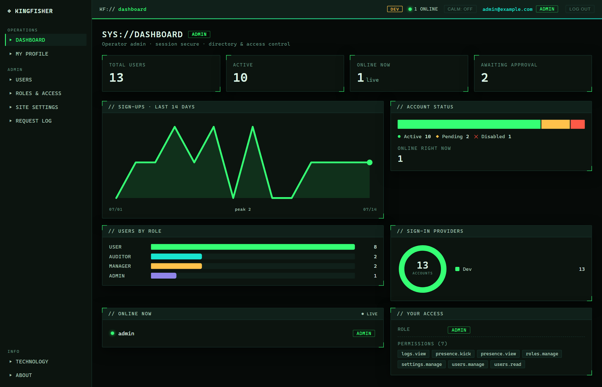

### User directory — expanded & permission-gated
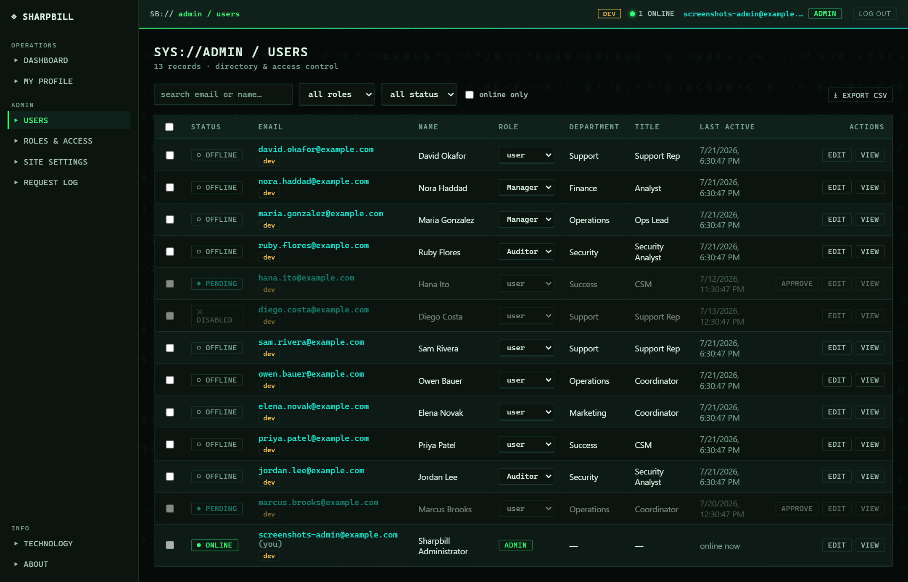

### Inline edit — the full profile editor in a modal
Identity, profile fields, and admin controls (role / active / kick) — each gated by permission.

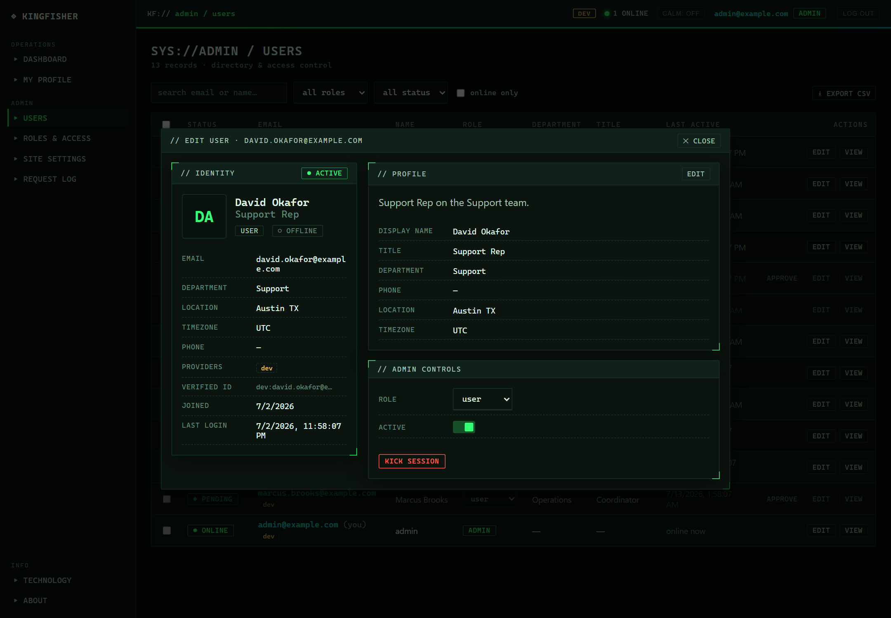

### Roles & Access — the permission-matrix builder
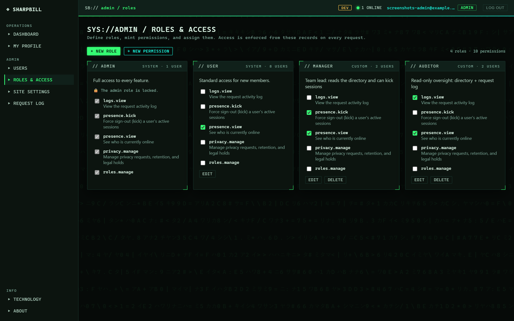

### Request activity log
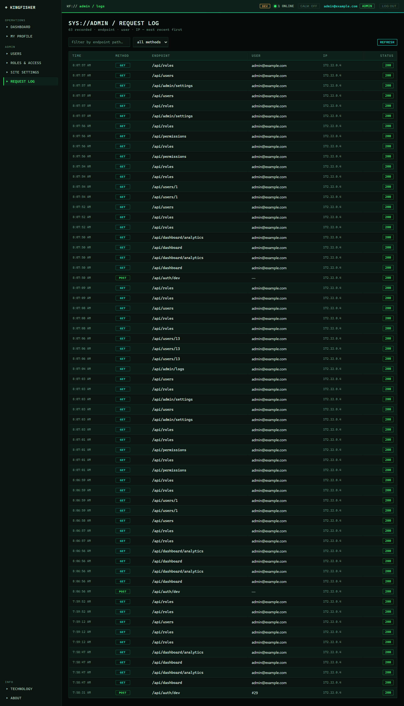

### Site settings — sign-up mode, providers, approvals
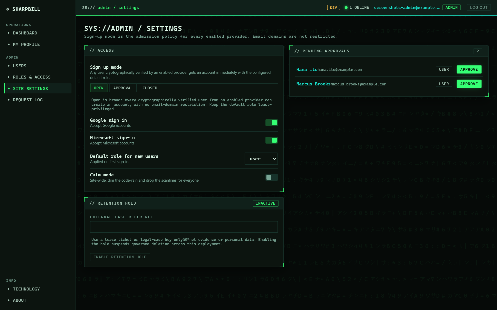

### Profile & identity
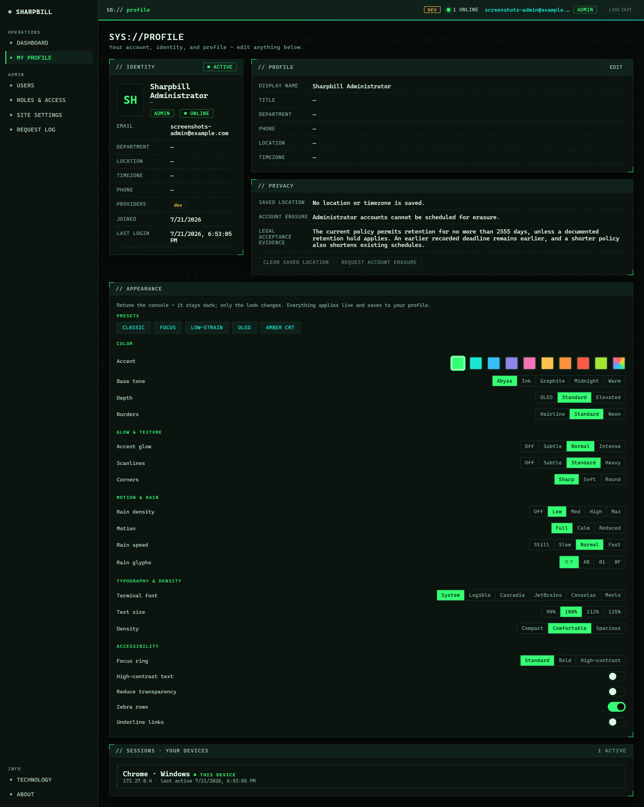

### A user's detail page
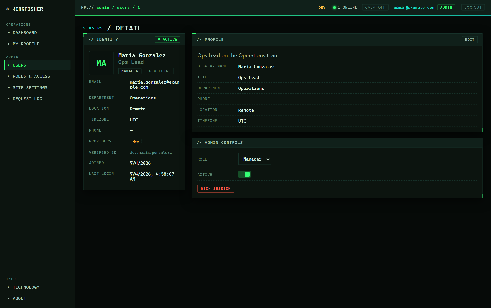

### Security — auth & permission walkthrough
A public page that walks the exact path a request takes: verifying the human at sign-in, then the
per-request permission gate.

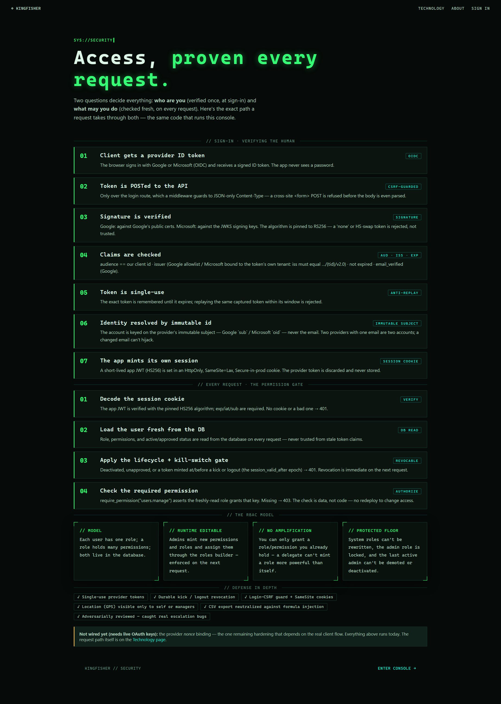

### Sign in
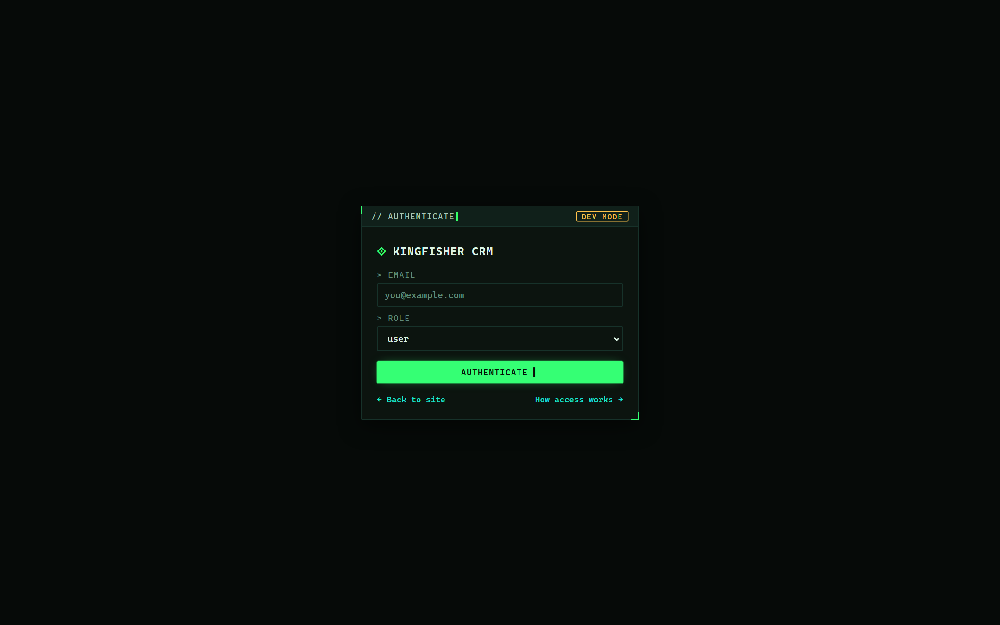

### Technology & About
| Technology | About |
|---|---|
| 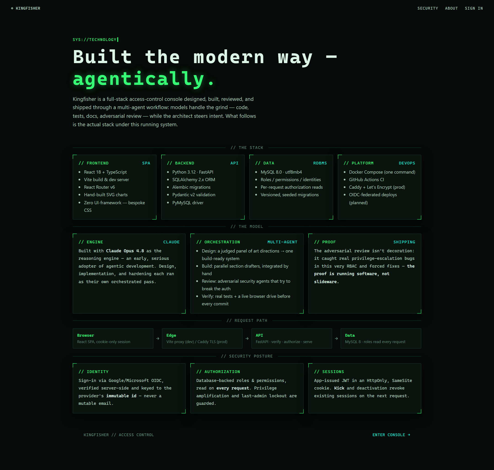 | 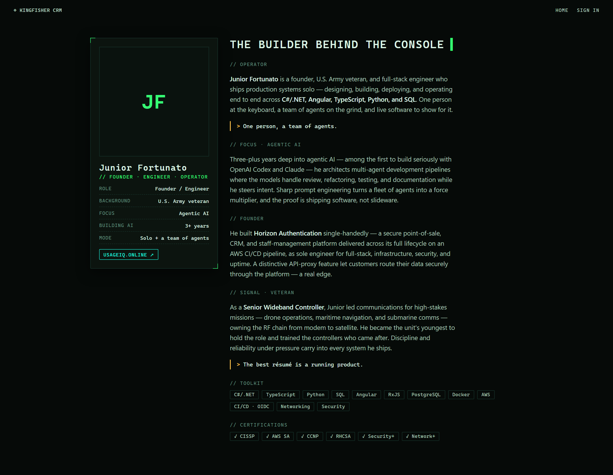 |

---

## Architecture

- **Backend** — **.NET 10 + ASP.NET Core** with explicit Domain, Contracts, Application,
  Infrastructure, Workers, and API projects. Controllers are transport-only; architecture tests
  reject persistence dependencies in controllers and pin the focused dependencies of the user and
  authentication facades. User query, profile, access, and lifecycle use cases live in Application,
  together with authentication policy, admission, identity mapping, and security-event
  construction; provider, database, token, and session adapters remain in Infrastructure. The
  built-in DI container supplies every boundary. Middleware owns canonical request context,
  security headers, CSRF checks, body limits, request logging, and error handling, while
  business/query time is supplied through `IClock`. Persistence uses **Dapper + MySqlConnector**,
  with bounded retry only for MySQL deadlock/lock-wait faults. All routes live under `/api`, and
  errors preserve the `{"detail": {"code", "message"}}` envelope. The C# runtime cutover is
  complete; no Python service is part of the active application or container path.
- **Frontend** — **React 18 + TypeScript + Vite**, React Router v6, hand-written CSS
  (the "DATASTREAM" terminal theme), Vitest unit coverage, and Playwright E2E coverage. Vite
  proxies `/api` (including WebSocket upgrade) to the API in local development.
- **Database** — digest-pinned **MySQL 8.4.10 LTS** (`utf8mb4`). `Sharpbill.Migrator` applies the
  reviewed `0021` snapshot to an empty database, or validates and journals an existing exact `0021`
  database. The frozen Alembic migrations `0001`…`0021` remain immutable historical schema
  provenance; the ASP.NET Core API never mutates schema on startup. One database represents one
  organization, not a shared multi-tenant SaaS schema.
- **Runtime** — **Docker Compose** (`mysql` + explicit one-shot `migrator` + published non-root
  `api` + Vite development `web`) for loopback-only local operation. Run `dotnet watch` directly
  from the SDK when backend hot reload is needed. CI pins the .NET 10 SDK and Node 24.

```
Browser ──HTTP/WS──▶  Vite dev server ──proxy /api──▶  ASP.NET Core  ──▶  MySQL
                              │                              │
                        React SPA                 services + Dapper
```

Identity flow: provider ID token → **verified server-side** → app issues its own short **HS256
session JWT** in an `HttpOnly`, `SameSite=Lax` cookie → role + permissions + active/approved state
re-read from the DB on every request.

Successful provider login also persists the signed Google hosted-domain (`hd`) or Microsoft tenant
(`tid`) context separately from mutable email. These claims support attribution, tenant-scoped
Microsoft identity, and immutable bootstrap checks; they are not ordinary-account domain
allowlists. Readiness and administrative-recovery guards fail closed when a claimed bootstrap
identity is inactive, demoted, pending, or no longer matches its immutable bootstrap configuration.

---

## Security model

The application controls below are exercised by local automated tests and adversarial source
review. They do not establish production readiness or legal/regulatory compliance. Highlights:

- **Verified provider identity.** ID tokens are validated server-side — signature (Google certs /
  Microsoft JWKS), `aud` == client id, issuer (Google allowlist / Microsoft `tid`-bound), expiry,
  `email_verified` (Google), `RS256` pinned (no alg-confusion) — and identity is keyed on the
  **immutable subject** (Google `sub` / Microsoft tenant-scoped `(tid, oid)`), never email. Two
  providers sharing an email are two accounts; a changed email never merges or hijacks.
- **Bounded provider key retrieval.** Google certificates and Microsoft JWKS use short explicit
  network timeouts, bounded verification/fetch concurrency, a size-capped single-flight cache,
  stale-key outage tolerance, and circuit/unknown-`kid` backoff. A disabled provider is rejected
  from database state before any outbound verification work.
- **Single-use login state.** Both browser provider flows bind a database-backed, single-use nonce
  into the provider ID token. Issuance uses 64 database-coordinated admission shards whose quotas
  total 5,000 active nonces, avoiding a global login lock while preserving a cross-replica bound.
  A second, process-local replay guard rejects a reused raw token within its validity window; that
  supplemental raw-token cache still belongs at a shared control plane for multi-replica operation.
- **No privilege amplification.** You can only grant a role/permission you already hold; system
  roles are admin-only to edit; the `admin` role is locked.
- **Least-privilege exports and evidence.** Directory CSV export requires `users.export`, separate
  from `users.read`; durable security-event reads/exports require `security_events.view`, separate
  from operational request-log access through `logs.view`. Both exports create security events.
- **Optimistic administrative writes.** Role reads return `version` and user reads return
  `access_version`. Role update/delete and user role/direct-grant mutations must submit that latest
  value as `expected_version`; omission returns `428`, while a stale value returns `409` instead of
  silently overwriting a newer administrator's decision.
- **Last-admin protection.** The final active admin can't be demoted or deactivated.
- **Durable revocation.** Kick and deactivation stamp a per-user token epoch, so old session
  cookies are rejected on the next request (and reactivation can't resurrect them).
- **Per-device sessions.** Each cookie is bound to a server-side session row (`jti`); revoking one
  signs out one device, kick revokes them all — a stateless JWT with server-tracked revocation.
- **Bounded lock-fault recovery.** Replay-safe database transaction boundaries retry only MySQL
  deadlock/lock-wait errors (`1213`/`1205`) up to three attempts with exponential jitter. Auth,
  session, nonce, retention, request-log, and repository-owned transactions share the policy and
  emit retry/recovery/exhaustion telemetry; arbitrary failures and side effects are not retried.
- **Session-token contract and rotation.** Session JWTs require an explicit issuer, audience,
  token type, subject, `jti`, issue time, expiry, and key ID. A bounded previous-key ring supports
  overlap rotation (at most five previous secrets); production cookies use the browser-enforced
  `__Host-` prefix.
- **Location privacy.** List, detail, and kick responses strip opt-in GPS for anyone who isn't the
  user themselves or a `users.manage` holder.
- **CSV-injection safe.** Exported cells beginning with `= + - @` are neutralised.
- **Browser mutation checks.** Cookie-setting login routes require JSON, and unsafe API methods
  reject cross-origin/same-site browser requests using Origin/Referer and Fetch Metadata checks;
  the session cookie is also `SameSite=Lax`.
- **Rate limiting.** Per-IP throttling on nonce/sign-in routes plus a global `/api` backstop,
  keyed on the socket peer or a client address accepted only from configured trusted proxies,
  and a shared no-queue concurrency gate for user/security-event CSV exports,
  returns `429` with `Retry-After`. The limiter is process-local, so the reference production
  topology runs one API replica until an edge or shared limiter is supplied.
- **Bounded readiness.** Process-only liveness never touches dependencies. Database-backed
  readiness has a separate probe bucket and brief nonblocking single-flight cache, so public probes
  cannot bypass application throttling and pile up database checks.
- **Onboarding policy.** The database-backed `signup_mode` is the sole new-account admission
  control: open admits verified identities, approval creates pending accounts, and closed rejects
  new non-bootstrap identities. Google `hd` and Microsoft `tid` are verified context, not domain
  allowlists. Provider toggles still fail closed before token verification.
- **Input bounds.** ASP.NET Core middleware enforces a configurable total request-body limit even
  when `Content-Length` is absent (1 MiB by default), and identity/location DTOs impose field and
  finite-number limits.
- **Production startup and admission guards.** Production mode requires secure cookies, verified
  database TLS, a canonical HTTPS `PUBLIC_ORIGIN`, and at least one configured identity provider.
  Traffic readiness additionally requires an effectively enabled provider in site settings, a
  non-admin default role, and either an accessible active administrator or a valid bootstrap path.
  Production also validates Google web-client-ID syntax, requires the Azure
  client ID to be a UUID, and accepts proxy trust only as explicit IP/CIDR entries; hostnames,
  wildcards, and production-wide `0.0.0.0/0` or `::/0` trust are rejected. The environment owner
  must still enforce TLS at the database, edge, and network layers.

---

## Quick start

```bash
cp .env.example .env
# REQUIRED: set MYSQL_DATA_VOLUME to an explicit new MySQL 8.4 volume name, for example
# MYSQL_DATA_VOLUME=sharpbill_mysql84_data. For existing data, use only a separately restored
# and validated 8.4 volume; never point MySQL 8.4 at an 8.0 data directory implicitly.
openssl rand -hex 32   # paste into SESSION_JWT_SECRET
# For automated local dev-login only: generate a DIFFERENT value for DEV_AUTH_SECRET,
# set DEV_AUTH_ENABLED=true, and send it in X-Dev-Auth-Secret. Keep this disabled otherwise.

docker compose up -d mysql
docker compose run --rm migrator migrate
docker compose run --rm migrator seed-demo   # optional: local demo users + roles
docker compose up --build -d api web

#   http://localhost:5173          → the app (landing page)
#   http://localhost:8000/api/docs → API docs
#   http://localhost:8000/api/health/live   → process liveness
#   http://localhost:8000/api/health/ready  → traffic-admission readiness
```

The host ports default to `5173`, `8000`, and loopback-only `3306`; override
`WEB_HOST_PORT`, `API_HOST_PORT`, or `MYSQL_HOST_PORT` in `.env` if needed.

`/api/health/live` answers only whether the API process is alive. `/api/health/ready` returns `200`
only when MySQL is reachable, the database matches the exact `0021` compatibility baseline, at
least one configured provider is enabled in site settings (or the explicitly enabled local dev path is
usable), the signup default is not the protected admin role, and an active administrator can use
an effective provider or a valid bootstrap path remains. A new stack can therefore be live while
readiness intentionally returns `503` until migrations and identity/admin admission are configured.

An upgrade of a legacy database that crosses frozen migration `0013` includes potentially
blocking/rebuilding MySQL DDL. The C# migrator deliberately refuses that partial history. A
database below `0021` requires an operator-owned, explicitly approved, source-matched archival
migration artifact whose provenance and digest have been verified; this repository neither builds
nor publishes that artifact. Use it only on an isolated clone and follow the
[0013 DDL maintenance-window procedure](docs/ENTERPRISE_OPERATIONS.md#0013-ddl-maintenance-window)
with measured table sizes, metadata-lock checks, a verified backup, drained writes, and post-change
readiness validation.

Development-only reset (permanently deletes the Compose database volume):
`docker compose down -v`, followed by the Quick start database and migrator commands above.
Never use that command against data that must be retained.

---

## Signing in

- **Versioned legal acceptance** is a server-enforced login precondition for every provider,
  including local dev-auth. The browser retrieves `/api/legal/manifest`, presents individually
  linked Terms, EULA, Acceptable Use Policy, and Privacy Notice, and sends an explicit checkbox
  decision with the exact bundle version. The web build verifies canonical per-document SHA-256
  digests from the manifest, and successful session evidence snapshots those versions and digests.
  Missing acceptance and stale/mismatched clients fail closed before a session is issued. The
  checked-in legal text is a counsel-review draft; see
  [`docs/LEGAL_DOCUMENTS.md`](docs/LEGAL_DOCUMENTS.md) for the required operator inputs and release
  procedure.
- **Google and Microsoft** appear only when each provider has both application credentials and its
  database setting enabled. The SPA reads the effective provider flags and public OAuth client IDs
  at runtime from `/api/auth/config`; no environment-specific client ID is baked into the static web
  image. The browser obtains a server nonce, passes it through the provider flow, and posts the
  returned ID token for server-side verification. Google Identity Services is loaded on demand;
  Microsoft uses an MSAL popup.
- **Dev login** (automated local testing only): `POST /api/auth/dev` is mounted only when
  `APP_ENV=local`, `DEV_AUTH_ENABLED=true`, and a strong, independent `DEV_AUTH_SECRET` is set.
  Every call, including `GET /api/auth/dev/roles`, must present that value in
  `X-Dev-Auth-Secret`. A caller may choose a role only while creating a new local test account;
  signing in as an existing account does not rewrite its role, profile, approval, or active state.
- **Admin bootstrap** is provider-specific: production Google bootstrap requires an immutable
  subject in `GOOGLE_ADMIN_SUBJECTS` (production rejects email-based `ADMIN_EMAILS`); Microsoft
  requires both the signed tenant in `AZURE_ADMIN_TENANT_ID` and the immutable object ID in
  `AZURE_ADMIN_OBJECT_IDS`. This tenant binding protects bootstrap identity; it is not an onboarding
  allowlist.
  `ADMIN_EMAILS` remains a local-development recovery convenience only. Review and remove
  bootstrap values after initialization.
- A public **[Security walkthrough](#security--auth--permission-walkthrough)** (`/security`) explains
  the sign-in verification and the per-request permission gate, step by step.

---

## API surface

| Method | Path | Permission | Purpose |
|---|---|---|---|
| GET | `/api/health/live` | — | process-only liveness |
| GET | `/api/health/ready` | — | DB, schema, effective identity, admin-path, and admission readiness |
| GET | `/api/health` | — | backward-compatible readiness alias |
| GET | `/api/auth/config` | — | effective sign-in methods and their public runtime OAuth client IDs |
| GET | `/api/legal/manifest` | — | current login-required legal bundle, document versions, and canonical SHA-256 digests |
| POST | `/api/auth/nonce` | — | issue bounded, single-use provider login state |
| POST | `/api/auth/google` · `/microsoft` | — | verify ID token → session cookie |
| POST | `/api/auth/dev` | — (local only) | dev login |
| GET | `/api/auth/dev/roles` | — (local only) | role names for the dev-login picker |
| POST | `/api/auth/logout` | — | clear cookie (durable revoke) |
| GET | `/api/auth/me` | session | current user |
| POST | `/api/auth/location` | session | store optional last-known GPS |
| GET · DELETE | `/api/auth/sessions[/{id}]` | session | list / revoke your own device sessions |
| GET | `/api/privacy` | session | current retention policy, hold state, and erasure status |
| DELETE | `/api/privacy/location` | session | immediately clear saved exact and derived location |
| POST · DELETE | `/api/privacy/erasure-request` | session | schedule / cancel personal erasure during the grace period |
| GET · DELETE | `/api/users/{id}/sessions[/{sid}]` | `users.read` / `presence.kick` | a user's sessions / revoke one |
| GET | `/api/dashboard` | session | headline stats (incl. online count) |
| GET | `/api/dashboard/analytics` | `users.read` | chart data (roles, providers, signups, status) |
| GET | `/api/users` | `users.read` | directory + filters (`search`, `role_id`, `status`, `online`, `limit`, `offset`) |
| GET | `/api/users/{id}` | self or `users.read` | user detail |
| PATCH | `/api/users/{id}/profile` | self or `users.manage` | edit profile fields |
| PATCH | `/api/users/{id}/role` | `users.manage` + `roles.manage` | reassign role with latest `access_version` precondition |
| PATCH | `/api/users/{id}/status` | `users.manage` | activate / deactivate |
| POST | `/api/users/{id}/approve` | `users.manage` | approve a pending sign-up |
| POST | `/api/users/{id}/kick` | `presence.kick` | force sign-out |
| POST | `/api/users/bulk` | `users.manage` (+ `roles.manage` for assign-role) | bulk actions |
| GET | `/api/users/export.csv` | `users.export` | byte/concurrency-bounded, streamed, self-audited CSV of the filtered directory |
| GET · PUT | `/api/admin/settings` | `settings.manage` | site settings (signup mode, providers, default role) |
| GET · PUT | `/api/admin/privacy[/hold]` | `privacy.manage` | policy/hold status and documented hold update |
| GET | `/api/admin/privacy/retention/metrics` | `privacy.manage` | retention cycle, failure, hold, backlog, and oldest-eligible health |
| POST · DELETE | `/api/admin/privacy/users/{id}/erasure-request` | `privacy.manage` | schedule / cancel verified account erasure |
| GET | `/api/roles` · `/api/permissions` | `roles.manage` | list |
| POST | `/api/roles` · `/api/permissions` | `roles.manage` | create |
| PATCH · DELETE | `/api/roles/{id}` | `roles.manage` | edit/delete with latest role `version` precondition |
| PUT | `/api/users/{id}/permissions` | `users.manage` + `roles.manage` | set direct grants with latest `access_version` precondition |
| GET | `/api/presence/online` | `presence.view` | who's online |
| POST | `/api/presence/heartbeat` | session | presence ping (WebSocket polling fallback) |
| WS | `/api/ws/presence` | session | real-time presence stream |
| GET | `/api/admin/logs` | `logs.view` | cursor-paged request activity; path-prefix filters and opt-in `include_total` |
| GET | `/api/admin/logs/metrics` | `logs.view` | queue health, rejection/post-enqueue loss counters, and event timestamps |
| GET | `/api/admin/logs/database-retry-metrics` | `logs.view` | bounded MySQL lock-retry, recovery, exhaustion counters, and timestamps |
| GET | `/api/admin/security-events` | `security_events.view` | cursor-paged durable security-event facts and delivery state |
| GET | `/api/admin/security-events/export.csv` | `security_events.view` | byte/concurrency-bounded, streamed, self-audited security-event export |

---

## Testing & CI

- **Backend** — the xUnit suites cover domain invariants, application policies and contract
  serialization, enforced layer dependencies, the dedicated migrator, service behavior, HTTP
  boundaries, identity, and Dapper repositories against real MySQL where integration state is
  required. CI exercises the migrator's dry-run, empty-database apply, exact-schema validation, and
  journal bridge before running the suite with coverage collection.
- **Frontend** — `vitest` + Testing Library over the code that gates access in the browser (the API
  client's error/401 handling, `RequirePermission`, badges).
- **E2E** — a Playwright job boots the local stack (Vite + ASP.NET Core + MySQL via Docker Compose) and
  drives representative flows through the secret-gated dev-login: admin sign-in and user editing,
  plus a plain user's denial from the admin directory. This exercises the application boundary; it
  does not test live provider tenants or external production controls.
- **CI** (`.github/workflows/ci.yml`, .NET 10 + Node 24) — immutable action revisions and
  read-only permissions; centrally pinned NuGet restore with transitive vulnerability rejection,
  formatting and analyzer enforcement, warnings-as-errors Release builds, migration
  dry-run/apply/validation, xUnit/TRX coverage evidence with a zero-test guard; locked npm install,
  TypeScript/ESLint, Vitest, build, and full dependency audit; production-image builds with a
  blocking High/Critical Trivy scan and uploaded SPDX SBOMs; and an ephemeral Compose/Playwright
  access-control flow with a masked, independent dev-auth secret. Protected `main` requires the
  frontend, backend, E2E, and production-image/supply-chain jobs to pass through a pull request.
  There is no deploy job. The workflow is repository test evidence, not proof of production
  environment controls, deployment approvals, or external security-service operation.

---

## Project layout

```
backend/   layered .NET 10 solution, ASP.NET Core API, workers, C# migrator, xUnit suites,
           and frozen Alembic 0001…0021 schema provenance
frontend/  React + Vite SPA (DATASTREAM terminal theme)
deploy/    production compose + Caddyfile (reference; not used locally)
docs/img/  README screenshots
.github/   protected-branch CI: quality, migration, coverage, supply-chain, and browser gates;
           Dependabot and CODEOWNERS live here too; no deploy job
```

---

## Common commands

```bash
docker compose run --rm migrator migrate                 # apply or bridge the reviewed schema
docker compose run --rm migrator validate                # read-only exact-schema validation
docker compose run --rm migrator seed-demo               # seed demo data (local only)
(cd backend && dotnet restore Sharpbill.slnx)
(cd backend && dotnet format Sharpbill.slnx --verify-no-changes --no-restore)
(cd backend && dotnet build Sharpbill.slnx -c Release --no-restore)
(cd backend && dotnet test Sharpbill.slnx -c Release --no-build)
docker compose exec web npm run lint                     # frontend typecheck + lint
docker compose logs -f api web                           # tail logs
```
